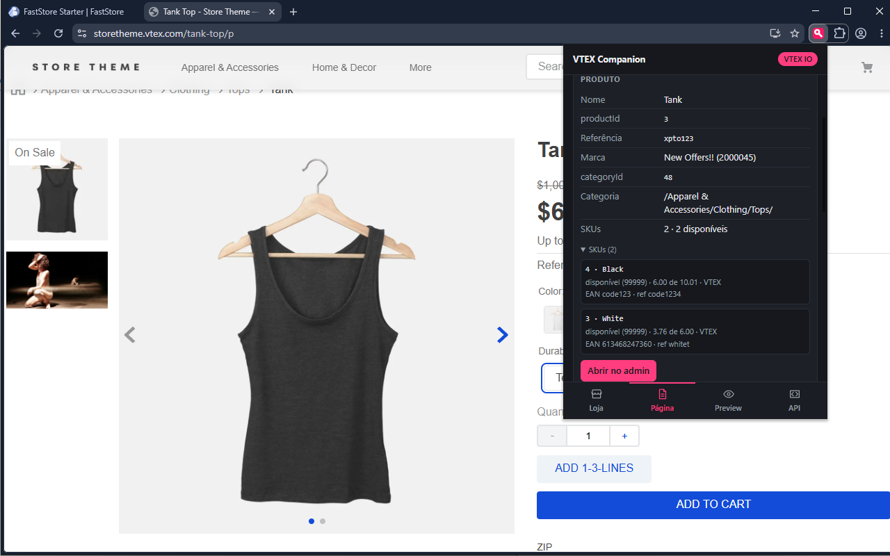
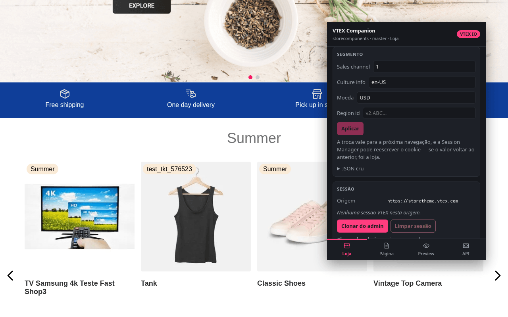
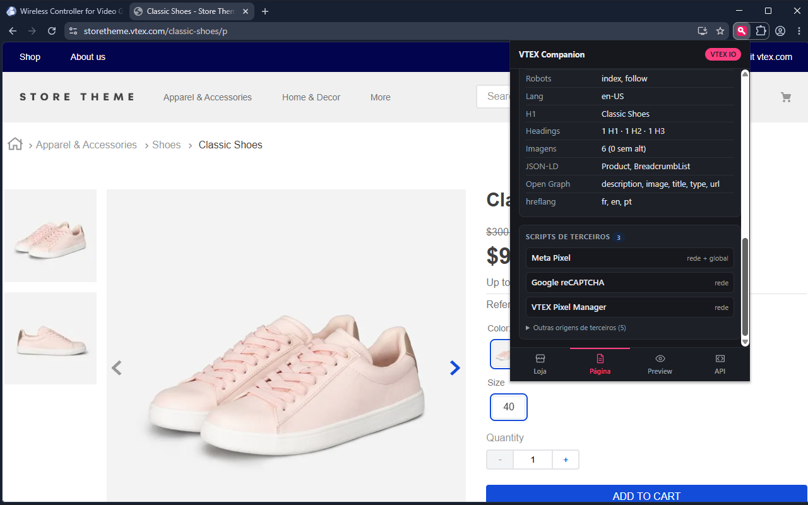
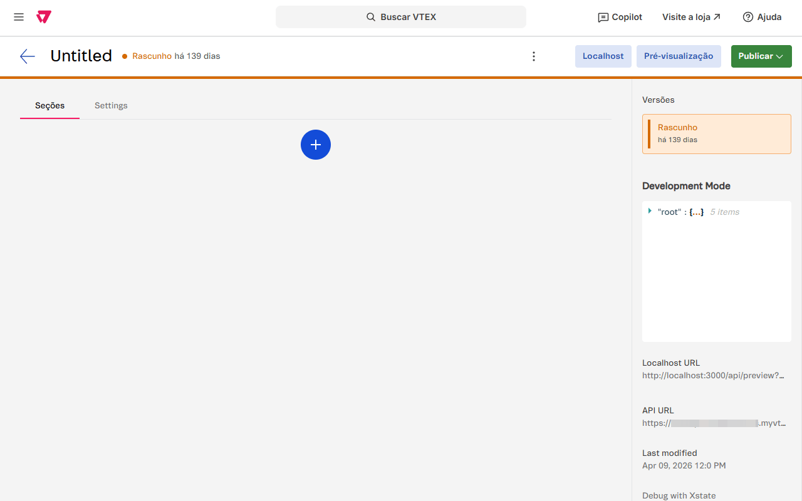

<div align="center">


# VTEX Companion

**Descubra a tecnologia VTEX por trás de qualquer loja, abra o preview do FastStore no seu `localhost` e chame as APIs com a sessão da aba — sem sair do navegador.**

[](https://chromewebstore.google.com/detail/vtex-companion/bolibelfgalkiclnpnfdgbdljikflfba)
[](https://addons.mozilla.org/firefox/addon/vtex-companion/)
[](https://wxt.dev)
[](https://react.dev)
[](https://www.typescriptlang.org/)
[](https://developer.chrome.com/docs/extensions/develop/migrate)
[](./LICENSE)

<br />

[](https://chromewebstore.google.com/detail/vtex-companion/bolibelfgalkiclnpnfdgbdljikflfba)
[](https://addons.mozilla.org/firefox/addon/vtex-companion/)

<sub>Chrome · Edge · Firefox · Firefox para Android · sem conta, sem telemetria</sub>

<br />

[Página do projeto](https://leocadio.dev/vtex-companion/) ·
[Privacidade](https://leocadio.dev/vtex-companion/privacy/) ·
[Roadmap](./docs/roadmap.md)

</div>

Extensão para quem trabalha com VTEX todo dia. Abra o popup em qualquer loja e
ela responde o que normalmente custa três abas do DevTools e um `curl`: qual
tecnologia renderiza aquela página, qual account e workspace, o que o catálogo
diz do produto, que pixels estão carregando, o que o SEO da página tem de
errado e quais cookies de sessão estão ali. E o recurso que originou o
projeto: abrir o preview do CMS do FastStore no `localhost`, com a query
inteira preservada.

Um único código-fonte gera os dois builds — Chrome com `service_worker`,
Firefox com `background.scripts`, ambos em MV3.

> ℹ️ **Não é um produto oficial da VTEX.** O ícone é original e a extensão não
> usa a identidade visual da VTEX.

## 📸 Capturas

<div align="center">



</div>

<div align="center">




</div>

<div align="center">




</div>

## ✨ Recursos

- 🔍 **Detecção** — é VTEX, com que confiança e por quais sinais; a tecnologia
  (IO/Store Framework, FastStore, CMS Legacy Portal ou headless); account,
  workspace e binding; admin ou loja final; tipo de página (home, PDP, PLP,
  busca, checkout, order placed, login, custom); e se há shopper logado ou
  sessão de admin.
- 📦 **Catálogo da página** — na PDP: produto, referência, marca, categoria e a
  lista de SKUs com EAN, refId, seller, disponibilidade e preço, mais atalho
  para o admin. Em listagem e busca: categoria, caminho, termo, `map`,
  ordenação e página.
- 🏷️ **Scripts de terceiros** — vendors conhecidos com o id da conta quando
  existe (GTM, GA4, Google Ads, Meta, TikTok, Clarity, Hotjar, Criteo,
  RD Station, Linx e outros), e as origens não catalogadas agrupadas por volume
  de requisições.
- 🍪 **Sessão** — os cookies presentes na origem com o escopo de cada um,
  clonagem da sessão de `{account}.myvtex.com` para o domínio da loja sem
  passar pela área de transferência, entrada por token colado, e limpeza que
  confere o resultado relendo os cookies.
- 🔀 **Workspace e flags de URL** — abrir a mesma rota noutro workspace, com os
  recentes e a volta ao master, e ligar `__siteEditor`, `__disableSSR`,
  `__disableRuntimeSSR`, `__disablePixels`, `__bindingAddress` e `sc` num clique,
  sem perder o resto da query. As flags do render-runtime só aparecem em loja
  VTEX IO, que é quem as lê. As duas formas de dizer o workspace estão em
  [`docs/url.md`](./docs/url.md).
- 🎯 **Segmento** — o `vtex_segment` da origem decodificado, com sales channel,
  culture info, moeda e region id em campos editáveis e o JSON inteiro para o
  resto (`priceTables`, `campaigns`, `utm_*`). Gravar recarrega a aba; o formato
  e o que a Session Manager faz depois estão em
  [`docs/segment.md`](./docs/segment.md).
- ⚡ **Fetch runner** — todos os métodos, com o cookie da aba atual. Presets de
  Sessão, Checkout, Catálogo, Intelligent Search, OMS e Master Data;
  confirmação explícita antes de qualquer método que altera dados; histórico da
  sessão; resposta formatada ou crua; cópia como JSON ou CSV.
- 🧭 **SEO da página** — indexação (`robots`, `googlebot`), title, description,
  canonical, lang, Open Graph, Twitter, hreflang, JSON-LD, headings e imagens
  sem alt, com regras por tipo de página (PDP sem `Product`, listagem sem
  `ItemList`).
- 🖥️ **Preview no `localhost`** — quatro caminhos, nenhum dependente do
  `cmsDevMode`. Vale para as duas versões do CMS do FastStore.
- 🧰 **Painel no DevTools** — o runner com a janela inteira, mesmo estado e
  mesmos componentes do popup.
- 📱 **Firefox para Android** — o popup inteiro funciona no aparelho.
- 🔒 **Nada sai da máquina** — sem conta, sem servidor, sem telemetria. O token
  de sessão nunca é gravado em `storage`.

## 📦 Instalação

**[⬇️ Chrome / Edge](https://chromewebstore.google.com/detail/vtex-companion/bolibelfgalkiclnpnfdgbdljikflfba)**
· **[⬇️ Firefox / Firefox Android](https://addons.mozilla.org/firefox/addon/vtex-companion/)**

Na primeira vez que você usar a extensão num domínio de loja, ela pede acesso
àquele site com um clique em **Conceder acesso a este site**. É opcional e vale
por origem — veja [Permissões](#-permissões).

<details>
<summary>Carregar um build local</summary>

```bash
pnpm install
pnpm build            # .output/chrome-mv3
pnpm build:firefox    # .output/firefox-mv3
```

No Chrome: `chrome://extensions` → **Modo do desenvolvedor** → **Carregar sem
compactação** → `.output/chrome-mv3`.
No Firefox: `about:debugging#/runtime/this-firefox` → **Carregar extensão
temporária** → `.output/firefox-mv3/manifest.json`.

</details>

## 🎮 Uso

O popup abre em quatro abas, e a mesma interface está no painel **VTEX
Companion** do DevTools:

| Aba | O que faz |
| --- | --- |
| **Loja** | Tecnologia, account, workspace, binding e sessão |
| **Página** | Template detectado, catálogo, SEO e scripts de terceiros |
| **Preview** | Redirecionamento para o `localhost`, última URL capturada e `cmsDevMode` |
| **Runner** | Requisições às APIs VTEX com o cookie da aba atual |

### 📱 No Android

O build do Firefox é oferecido no Android, e lá tudo passa pelo popup:
detecção, catálogo, SEO, scripts, sessão e o runner. Duas coisas não existem no
aparelho — o painel do DevTools, porque o Firefox para Android não tem
DevTools, e o preview no `localhost`, que pressupõe um dev server na mesma
máquina.

### 🖥️ Preview no localhost

O recurso é do CMS do FastStore, nas duas versões: o Headless CMS (legacy) e o
Storefront > Content. VTEX IO e o portal legacy têm pré-visualização própria,
por workspace, e não passam por aqui — a aba Preview diz isso quando a loja
aberta é de uma dessas plataformas, em vez de oferecer controles inertes.

São quatro caminhos, nenhum deles dependente de `cmsDevMode`:

1. Redirecionamento automático da aba de preview (toggle no popup)
2. Botão **Localhost** injetado ao lado de "Pré-visualização" no admin
3. Última URL de preview capturada, com copiar/abrir no popup
4. Liga/desliga do `cmsDevMode`, com status por frame

Com o `cmsDevMode` ligado, o painel Development Mode também ganha um
**Localhost URL** clicável ao lado do "API URL" do próprio CMS — o
comportamento do userscript que originou o projeto.

<details>
<summary>Por que funciona nas duas versões do CMS</summary>

O botão **Pré-visualização** abre uma aba para a Preview URL configurada na
loja. O formato muda entre as versões:

| CMS | URL que o botão abre |
| --- | --- |
| Headless CMS (legacy) | `https://{host}/?contentType=…&documentId=…&versionId=…` |
| CMS (Storefront > Content) | `https://{account}.vtex.app/api/preview?…` |

`lib/preview/rewrite.ts` troca só o origin e preserva a query inteira, forçando
`/api/preview` quando o path vem na raiz. É por isso que o recurso funciona nas
duas versões sem conhecer os parâmetros do CMS novo, que não são documentados.

O botão injetado no admin **não lê a URL do DOM**. Ele arma um redirecionamento
de uso único no background e clica no botão original — a URL real passa pelo
`webNavigation` e é reescrita lá. É o que dispensa o `cmsDevMode`.

</details>

## 🔒 Permissões

| Permissão | Para quê |
| --- | --- |
| `*://*.myvtex.com/*` | admin: content script e redirecionamento sem clique |
| `http://localhost/*` | abrir o dev server |
| `*://*/*` (opcional) | ler cookies e sessão da loja, concedida por site no popup |
| `activeTab` | leitura pontual da página quando o popup é aberto |

Não há content script em `<all_urls>`: a leitura dos globais da página é
injetada sob demanda pelo popup, com `scripting.executeScript`. Isso evita o
aviso de "ler dados em todos os sites" na instalação.

Sobre a sessão: o token nunca é gravado pela extensão nem sai da máquina, o
cookie é escrito `httpOnly` e `SameSite=Lax` — espelhando o real em vez de
afrouxá-lo — e os controles só aparecem em domínio reconhecido como VTEX.
Política completa em [`PRIVACY.md`](./PRIVACY.md).

## 🛠️ Stack

| Camada | Tecnologia |
| --- | --- |
| Framework | [WXT](https://wxt.dev) (MV3 nos dois navegadores) |
| Interface | React 19 + TypeScript |
| Testes | Vitest |
| Capturas | Playwright + sharp (`pnpm screenshots`) |
| Estado | `browser.storage` — `sync:` para preferências, `session:` para o resto |

A arquitetura tem uma regra só, e ela explica o resto: **decidir é separado de
fazer**. Detecção, reescrita de URL, análise de SEO, classificação de pixels e
montagem de requisição são funções puras sobre objetos simples, e são elas que
os testes cobrem. As sondas só leem; nunca julgam.

<details>
<summary>Estrutura de pastas</summary>

```
entrypoints/
  background.ts            roteador de mensagens e redirecionamento do preview
  cms-admin.content.ts     botão Localhost no admin (roda em todos os frames)
  popup/                   painel React
  devtools/                registra o painel no DevTools
  devtools-panel/          o runner com a janela inteira
ui/                        componentes e estado usados pelos dois painéis
lib/
  auth/                    escrita e clonagem do cookie de sessão
  catalog/                 alvo da busca + leitura do catálogo pela página
  detect/                  funções puras de detecção + contrato de tipos
  pixels/                  catálogo de vendors + classificação dos recursos
  runner/                  montagem, presets, execução e histórico do fetch
  seo/                     leitura das tags da página + regras de SEO
  preview/                 reescrita de URL, seletores do admin, cmsDevMode
  browser/                 cookies e leitura de globais da página
  vtex/session.ts          probe da Session Manager
  collect.ts               orquestra as três camadas para a aba ativa
```

No admin, o CMS do FastStore roda dentro de um iframe. `cms-admin.content.ts`
usa `all_frames: true`, e o `cmsDevMode` é lido e escrito com `allFrames: true`
porque `localStorage` pertence ao origin do frame — o do iframe, não o do topo.
Frames com sandbox sem `allow-same-origin` são reportados como indisponíveis em
vez de derrubar a leitura.

</details>

## 🚀 Desenvolvimento

```bash
pnpm install
pnpm dev              # Chrome, build + watch
pnpm dev:firefox      # Firefox, build + watch

pnpm test             # testes das funções puras (vitest)
pnpm compile          # typecheck (tsc --noEmit)
pnpm build            # build de produção (Chrome)
pnpm build:firefox    # build de produção (Firefox)

pnpm screenshots      # regera as capturas da listagem
pnpm promo            # bloco promocional da Chrome Web Store
```

Lint da AMO antes de publicar — tem de sair com 0 erros:

```bash
pnpm build:firefox && pnpm dlx web-ext lint --source-dir .output/firefox-mv3
```

Comentários de código em português; identificadores e mensagens de commit em
inglês. Mensagem de commit é prosa, e explica por que a mudança foi feita.

## 🗺️ Roadmap

Entregue:

| Status | Item |
| ------ | ---- |
| ✅ | Detecção em três camadas (URL/cookies, globais da página, Session Manager) |
| ✅ | Preview no `localhost` pelos quatro caminhos, sem depender do `cmsDevMode` |
| ✅ | Catálogo da página — PDP, listagem e busca |
| ✅ | Scripts de terceiros com id da conta por vendor |
| ✅ | Sessão: clonar, colar token e limpar, sem persistir credencial |
| ✅ | Segmento: `vtex_segment` decodificado e editável, com JSON cru |
| ✅ | Trocador de workspace e flags de URL, preservando a query |
| ✅ | Fetch runner com presets, confirmação de método inseguro e histórico |
| ✅ | Análise de SEO com regras por tipo de página |
| ✅ | Painel no DevTools compartilhando estado e componentes com o popup |
| ✅ | Build único para Chrome e Firefox, ambos MV3 |
| ✅ | Publicação nas duas lojas + Firefox para Android |
| ✅ | Capturas da listagem geradas por script (Playwright) |

Levantado e ainda não feito — o motivo de cada um está em
[`docs/roadmap.md`](./docs/roadmap.md), com o tamanho estimado
(**P** cabe numa sessão, **M** é função pura com testes mais a interface,
**G** precisa de desenho antes):

| Status | Item | Tam. |
| ------ | ---- | ---- |
| ⏳ | Runner: preencher `{slug}`/`{productId}`/`{skuId}`, presets salvos, copiar como cURL | M |
| ⏳ | `orderForm` — itens, totais, `marketingData`, limpar carrinho | M |
| ⏳ | Tema explícito (claro/escuro/sistema) e página de opções | M |
| ⏳ | i18n pt/en — interface e listagem têm de sair juntas | M |
| ⏳ | Tabela de SKUs escaneável, e o fim do `.frames` genérico | P |
| ⏳ | Copiar relatório da aba em markdown | P |
| ⏳ | Mais regras de SEO (canonical divergente, `noindex` em produção, H1 duplicado) | P |
| ⏳ | Atalhos de admin por template, além de produto | P |
| ⏳ | `aria-live` nos status e atalhos de teclado | P |
| 🔮 | Inspector de app e handle — `vtex-{app}-{major}-x-{handle}` no IO, `data-fs-*` no FastStore | G |

Não é compromisso de entrega nem ordem de execução: é o lugar onde a ideia fica
registrada com o motivo, para não precisar ser redescoberta.

## 🚢 Publicação

A 1.1.0 está publicada nas duas lojas — Chrome Web Store
(`bolibelfgalkiclnpnfdgbdljikflfba`) e AMO (slug `vtex-companion`).

Textos de listagem, justificativa de cada permissão e checklist de envio em
[`docs/publicacao.md`](./docs/publicacao.md) — inclusive a descrição pronta para
colar, que não se reescreve na hora do envio. A ordem das etapas de um release
está em [`docs/release.md`](./docs/release.md).

> ⚠️ Editar a listagem publicada custa uma revisão nova, mesmo para uma linha de
> descrição. Correções de texto viajam junto do próximo release; as que estão na
> fila ficam sob "Pendências da listagem" no roadmap.

A página de apresentação e a política de privacidade moram no repositório do
site (`portfolio-astro`), não aqui — o texto tem um dono só.

## 📄 Licença

[MIT](./LICENSE) © Gabriel Leocadio
